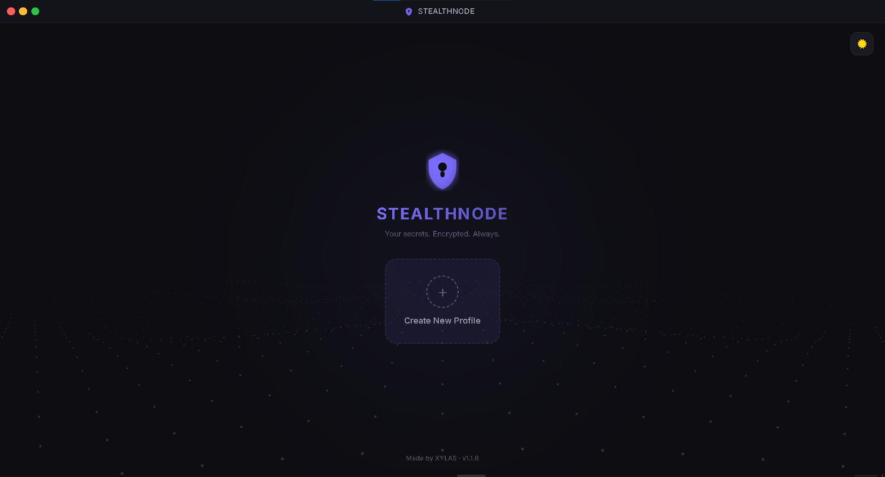
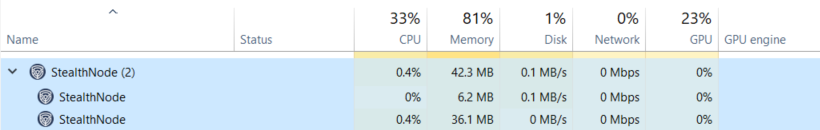
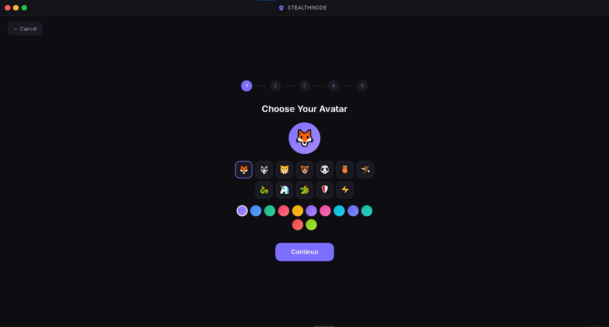
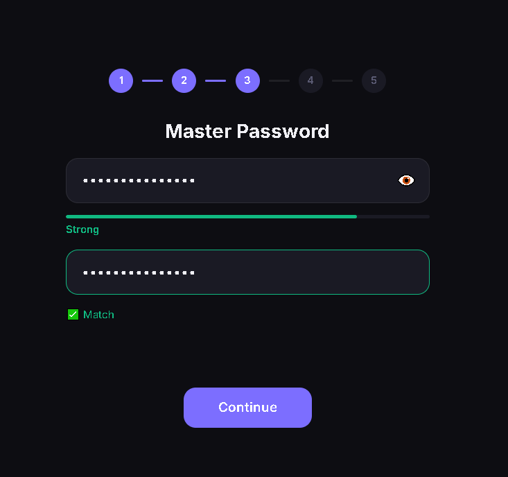
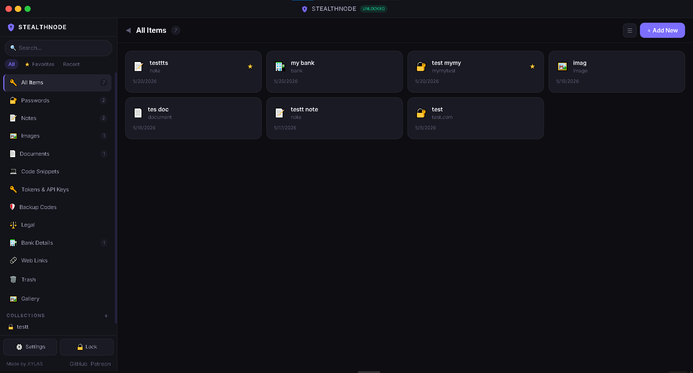
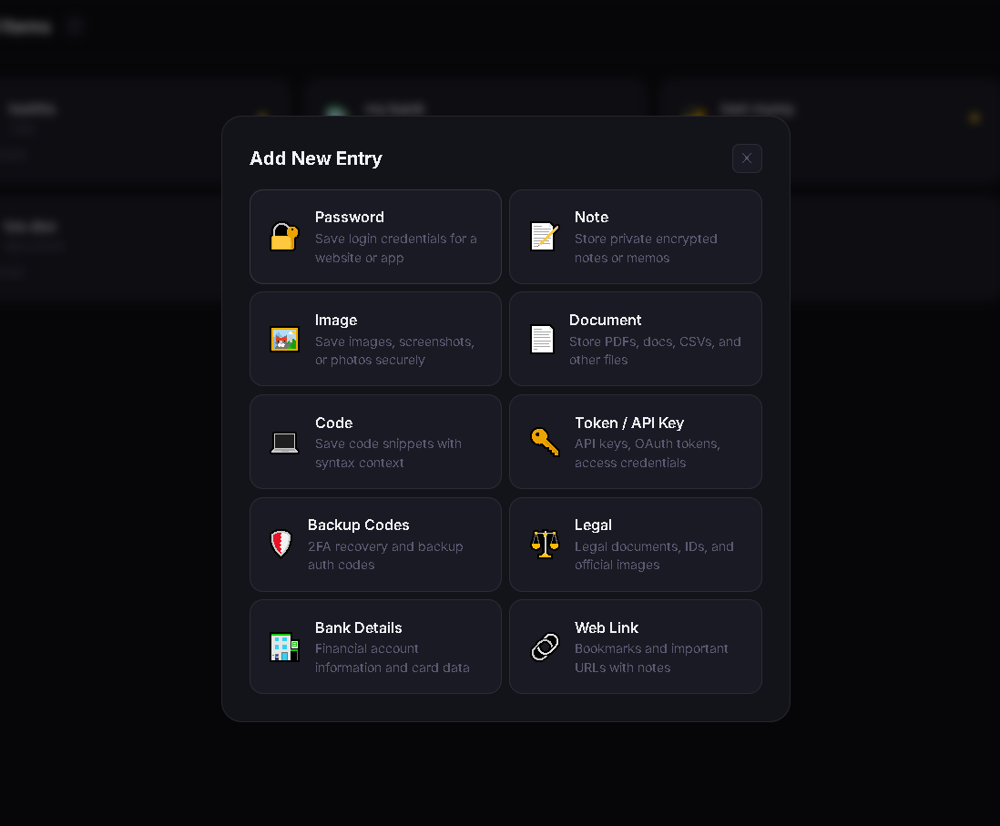
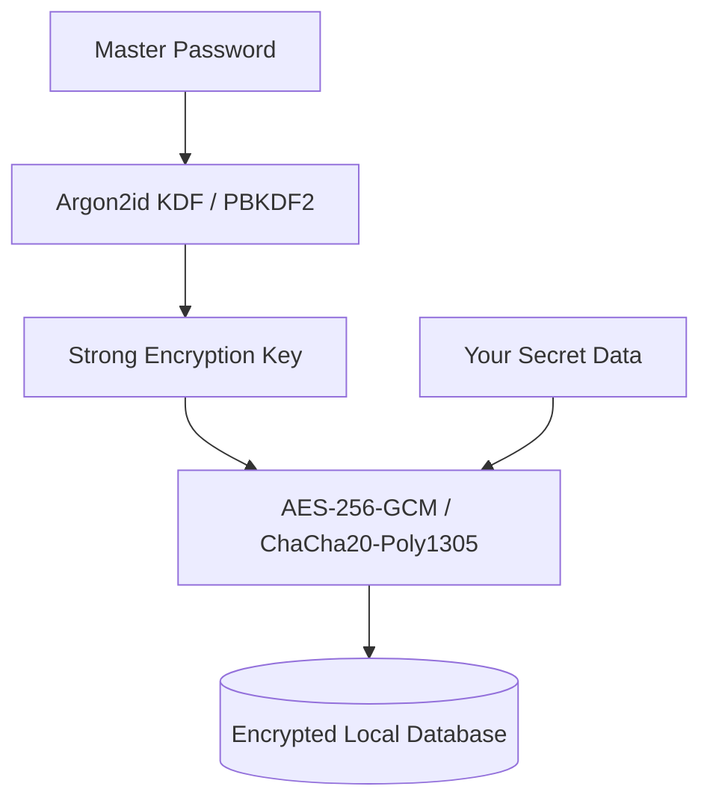

  
  <h1>🔒 StealthNode</h1>
  
<strong>Professional-grade, ultra-secure, local-first offline password and secrets manager for Windows.</strong>

  
  
  
  

---

## 🚀 About StealthNode

**StealthNode** is built for power users who demand total control over their digital credentials. 
In a world of cloud data breaches and subscription models, StealthNode takes a different approach: **Total Offline Sovereignty.**

> ⚠️ **BETA TESTING PHASE**  
> StealthNode is currently in active BETA testing. During this phase, the tool is **100% FREE for everyone**. Please test it out and let me know if you encounter any bugs, glitches, or errors by opening an issue!

### 🛡️ Why StealthNode?
- **100% LOCAL & OFFLINE**: The application has **absolutely zero access to the internet**. Your data never leaves your hard drive. There is no cloud, no telemetry, and no remote servers to be hacked.
- **MILITARY-GRADE ENCRYPTION**: All your passwords, notes, documents, and images are encrypted locally using industrial-grade authenticated encryption.

---

## 📸 Sneak Peek

  <table>
    <tr>
      <td></td>
      <td></td>
    </tr>
    <tr>
      <td></td>
      <td></td>
    </tr>
    <tr>
      <td></td>
      <td></td>
    </tr>
  </table>
  
<em>(Screenshots from StealthNode BETA v1.1.6)</em>

---

## ✨ Key Features

- **Multi-Category Storage**:
  - 🔑 **Passwords**: Detailed login details with web URLs and quick-copy.
  - 🏦 **Bank Cards & Accounts**: Keep financial details secure (CVV, ATM PIN, Internet Banking MPin).
  - 📝 **Secure Notes**: Dynamic rich-text editor for private journals and sensitive notes.
  - 🖼️ **Encrypted Image Gallery**: Securely encrypt and view private images with microsecond on-the-fly decryption.
  - 📎 **Encrypted Documents**: Securely store files, PDFs, or scanned legal documents.
  - 👾 **API Keys & Code Snippets**: Full syntax-highlighted IDE code blocks.
  - 🗂️ **Collections**: Organize secrets into custom-styled folders.

- **Embedded Power Tools**:
  - ⚡ **Entropy-Based Password Generator**: Real-time strength estimator.
  - 🗑️ **Trash Bin**: Accidental deletion recovery.
  - 📦 **Encrypted Backups**: Password-protected vault import/export utility (AES-256-GCM).
  - 🎨 **Ultra-Responsive UI**: Beautiful dark studio design with micro-animations, glassmorphism, and instant search filtering.

---

## 🔐 Security Architecture

StealthNode employs a strict, zero-trust security paradigm natively on your machine:

*Your Master Password is the only key. It is never saved anywhere. If you lose it, the vault is mathematically impossible to recover.*

---

## 🗺️ Future Roadmap

StealthNode is evolving fast. Here are the major updates planned for future releases (Not yet in the tool):

- [ ] **Open Source Release**: I plan to fully open source this tool for single users when it's done and I am satisfied with it (Cheap SaaS model for teams and businesses).
- [ ] **Global Command Palette**: `Ctrl+K` opens a spotlight-style search to jump to any entry or action instantly (like Raycast/Notion).
- [ ] **Smart Tags**: Custom tags (e.g., `#work`, `#2FA`) for cross-folder organization.
- [ ] **Recent & Frequently Used**: Quick Access section for your daily-use passwords.
- [ ] **Password Breach Check**: Local checking against known breached password databases.
- [ ] **Two-Factor Authentication (2FA)**: Add an extra layer of security to unlock the vault.
- [ ] **Vault Health Score**: Identify weak, reused, or compromised passwords.
- [ ] **Secure Share**: Generate a time-limited, one-time encrypted link to share a single entry securely over LAN.
- [ ] **Password Age Alerts**: Reminders to rotate old passwords.
- [ ] **Entry Templates**: Create custom schemas (e.g., "Server Login" with IP, Port, SSH Key).
- [ ] **Custom Fields**: Add infinite custom key-value pairs to any entry.
- [ ] **Universal Attachments**: Attach secure files to *any* entry type, not just documents.
- [ ] **Duplicate Detection & Merge**: Find duplicates and intelligently merge conflicting fields.
- [ ] ⭐ **Browser Extension**: A Chrome/Edge extension that securely auto-fills passwords locally.
- [ ] **Drag to Reorder & Pinned Entries**: Custom sorting and pinning your top 5 entries.
- [ ] **Bulk Actions**: Delete, move, or edit multiple entries at once.
- [ ] **Entry Expiry Reminders**: Set expiry dates for passports/IDs with Windows notification reminders.
- [ ] **Compact / Focus Mode**: A slimmed-down UI for rapid data entry.
- [ ] **Vault Statistics Page**: A dashboard analyzing your digital footprint.
- [ ] ⭐ **LAN Sync Between Devices**: Sync the vault between two PCs on the same network securely *without any cloud*.
- [ ] **Encrypted USB Export**: Carry a portable, encrypted copy of your vault on a thumb drive.
- [ ] **Migration Tools**: Import natively from other popular password managers.

---

## 📥 Installation

1. Go to the [Releases](https://github.com/xylas007/stealth-node/releases) page.
2. Download the latest `StealthNode-Setup.exe` installer.
3. Run the installer and follow the prompt.
4. Launch the app, create your first offline profile, set a strong Master Password, and you're good to go!

---

## 🤝 Community & Support

StealthNode is proudly developed and maintained by **XYLAS**.

- 🐙 **GitHub**: [@xylas007](https://github.com/xylas007)
- 🧡 **Support the Project on Patreon**: [Patreon/xylascode](https://www.patreon.com/cw/xylascode)

If you love the tool or find a bug during this BETA phase, please **open an issue** or leave feedback!

---

## 📄 License
This project is licensed under the MIT License - see the [LICENSE](LICENSE) file for details.
